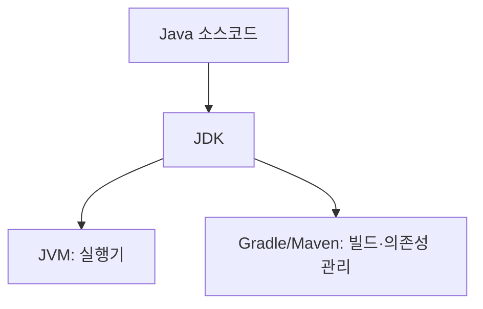
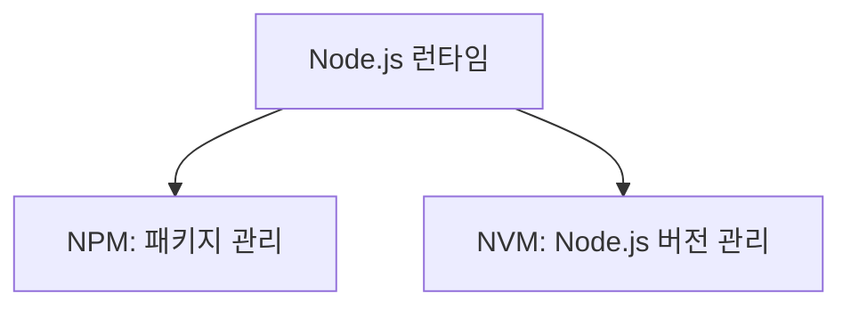

### 오늘 배운 내용 중 가장 기억에 남는 것

#### Node.js 설치 과정

웹 개발에서 가장 기본이 되는건 **HTML**이다. **HTML**은 웹 페이지의 뼈대, 즉 구조를 만드는 언어이다.  
하지만 **HTML**만으로는 단순히 정적인 문서밖에 만들 수 없기 때문에 **JavaScript**를 사용한다.  
**JavaScript**는 버튼을 누르면 창을 뜨게 하거나, 입력값을 검사하거나, 애니메이션을 주는 등 페이지를 동적으로 동작하게 만들어준다.  

원래 **JavaScript**는 브라우저 안에서만 실행되는 언어였다.  
그런데 웹이 점점 커지고 복잡해지면서 브라우저 밖에서도 자바스크립트를 실행해서 서버나 툴을 만들어달라는 요구가 생겼다.  
여기서 등장한게 **Node.js**이다.  

**Node.js**는 브라우저 엔진(V8)을 꺼내와서 운영체제 위에서 실행할 수 있게 만든 환경이다.  
덕분에 **JavaScript**로도 백엔드 서버를 만들 수 있고, 단순한 스크립트나 빌드 도구도 실행할 수 있게 된 것이다.  

**Node.js**를 설치하면 자동으로 **npm**이라는 도구도 같이 설치된다.  
**npm**은 **Node.js**생태계의 앱스토어 같은 것이다.  
필요한 라이브러리(예: React, Express, Lodash 등)를 받아오고, 프로젝트별로 의존성을 관리해 준다.  
우리가 웹 프로젝트를 할 때 다른 개발자가 만든 기능을 가져와서 쓰는 걸 도와주는 필수 도구이다.  

그런데 만약에 프로젝트마다 요구하는**Node.js** 버전이 다르다면?  
예를 들어 회사 A의 프로젝트는 **Node 16**에서만 돌아가고, 회사 B의 프로젝트는 **Node 20**이 필요할 수 있다.  
이 때 매번 **Node.js**를 삭제하고 다시 설치하는 건 굉장히 불편하다.  
그래서 나온게 **nvm**이다. **nvm**은 **Node Version Manager**의 줄임말로,  
여러 **Node.js** 버전을 한 컴퓨터 안에 설치 해두고 원하는 버전으로 자유롭게 바꿔서 쓸 수 있게 해준다.

***

### 오늘 배운 내용 중 가장 어렵거나 헷갈렸던 것

####  Java 진영 vs Node.js 진영

- Node.js를 배우면서 Node.js에서의 NPM역할을 Java에서는 뭐였냐는 대답에 JVM이라고 대답했다.  
 아직도 개념을 많이 헷갈려 하는거 같으므로 정리를 제대로 하자.





| 구분 | Java 진영 | Node.js 진영 |
|------|-----------|--------------|
| 언어 | **Java** | **JavaScript / TypeScript** |
| 실행기 | **JVM** (Java Virtual Machine) | **Node.js** (런타임, V8 엔진 기반) |
| 개발 툴킷 | **JDK** (컴파일러, 라이브러리 포함) | **Node.js 설치 패키지** |
| 빌드 / 의존성 관리 | **Gradle, Maven** | **NPM (Node Package Manager)** |
| 버전 관리 | **SDKMAN!, jEnv 등** | **NVM (Node Version Manager)** |

***
   
### 오늘 강의시간, 회고시간에 대한 느낀점 (부족했던 부분이나 재밌었던 부분 등)

- [블로그에 작성한 TIL](https://velog.io/@daheenamic/멋사-19기-백엔드-TIL-HTML)

```text 
드디어 프론트엔드로 들어가면서 Node.js를 설치하고, 서버를 설치하고 실행하여 HTML을 시작했다.
Node.js도 배워보고 싶었던 것 중에 하나였는데 커리큘럼에 들어가 있어서 너무 반가웠다.
당연히 알고 있어야 할 것들을 그동안 모르고 있었던 것 같은 느낌이 많이 들었다.
그래서 설치 과정도 재밌었고, 잘 따라갈 수 있었다.
HTML으로 간단한 회원가입 페이지를 실습했는데 아직 CSS가 부족해 디자인은 엉망이다.
그리고 아직 JavaScript를 들어가지 않아 구현에 제한이 있어서 조금 답답했다.
빨리 JavaScript를 배워서 내 미니 프로젝트를 콘솔이 아닌 화면에 보여주고 싶다.
```

